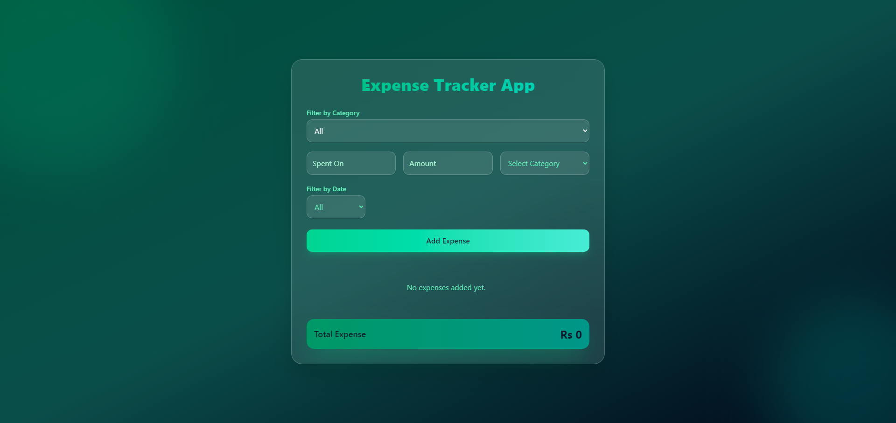

# Expense Tracker App 💰

A modern and responsive **Expense Tracker Web App** built with **React and Context API**.  
This project allows users to add expenses, filter them by category and date, and view the total spending in real time.

## 🚀 Live Demo
https://expense-tracker-react-flax.vercel.app/

## 📸 Preview



## ✨ Features

- Add new expenses
- Filter expenses by category
- Filter expenses by date (week / month)
- Real-time total expense calculation
- Clean and modern UI
- Responsive layout
- State management using React Context API
- Smooth UI with Tailwind CSS

## 🛠️ Built With

- React
- Context API
- Tailwind CSS
- Vite
- JavaScript (ES6+)

## 📂 Project Structure

```
src
 ├── components
 │     └── ExpenseTracker.jsx
 ├── context
 │     └── ExpenseContext.jsx
 ├── App.jsx
 ├── main.jsx
```

## ⚡ Getting Started

Clone the repository

```bash
git clone https://github.com/MuqtasidBhatti/expense-tracker-react.git
```

Install dependencies

```bash
npm install
```

Run the development server

```bash
npm run dev
```

Open in browser

```
http://localhost:5173
```

## 🎯 Learning Objectives

This project was built to practice:

- React component structure
- Global state management with Context API
- Handling forms and user input
- Filtering and calculating data
- Building modern UI with Tailwind CSS
- Deploying React apps with Vercel

## 📌 Future Improvements

- Edit and delete expenses
- Charts and analytics
- Local storage persistence
- Dark/light mode toggle
- Export expense report

## 👨‍💻 Author

**Muqtasid Bhatti**

GitHub:  
https://github.com/MuqtasidBhatti

LinkedIn:  
https://www.linkedin.com/in/muqtasid-bhatti-230525384/

---

⭐ If you like this project, consider giving it a star!